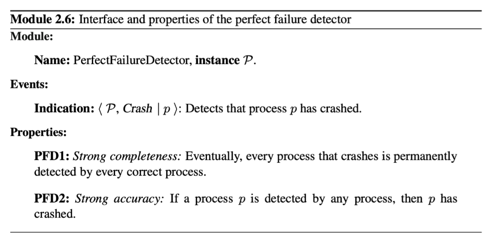
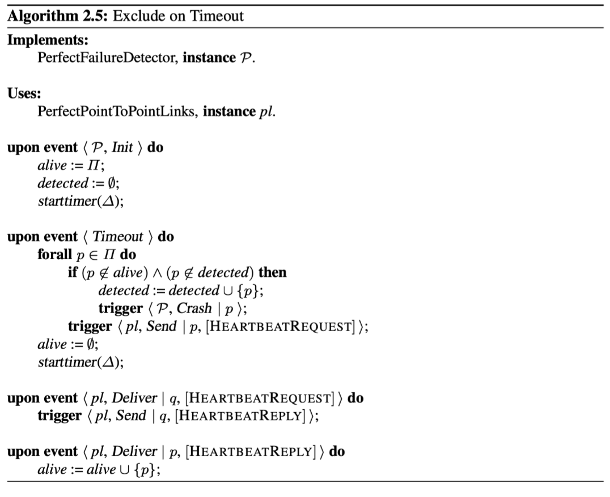
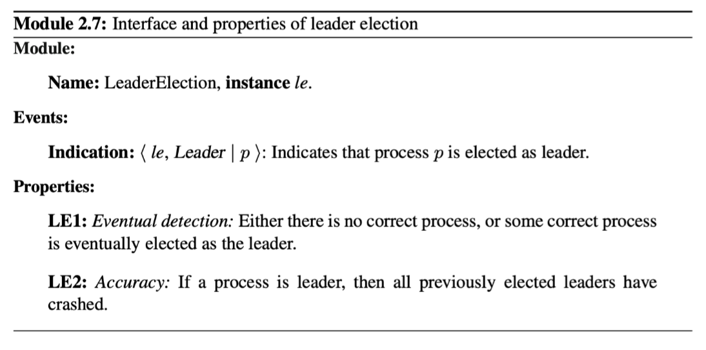
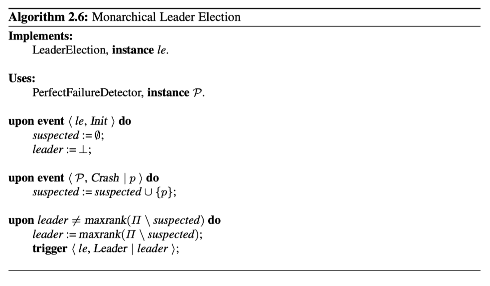
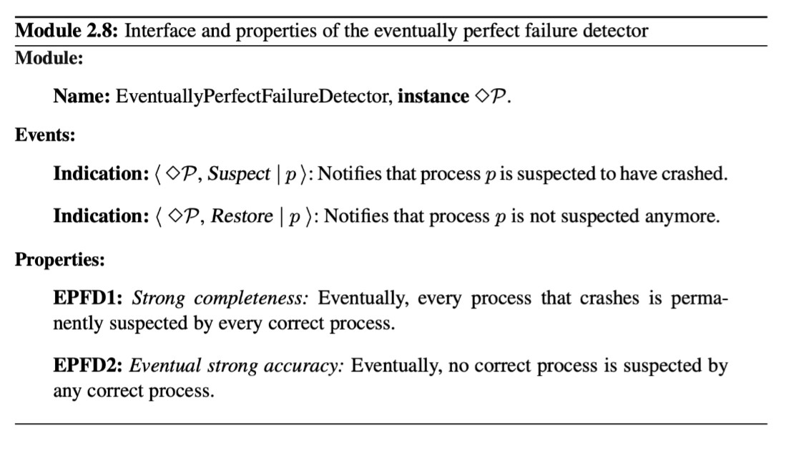
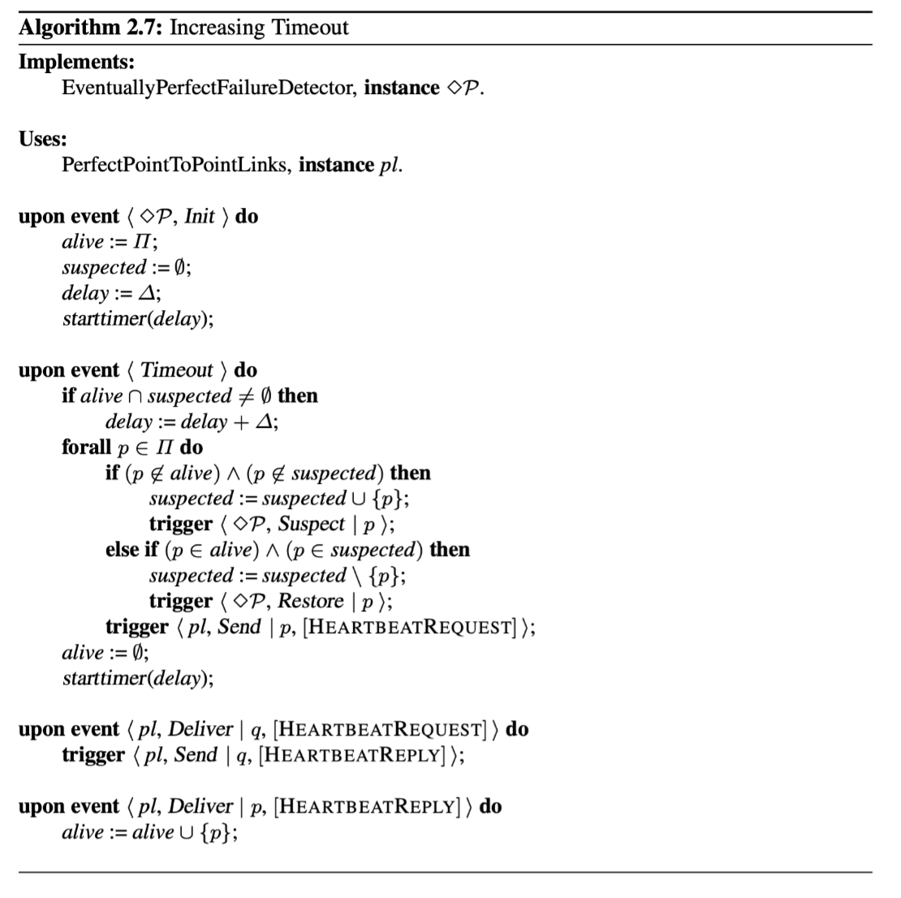
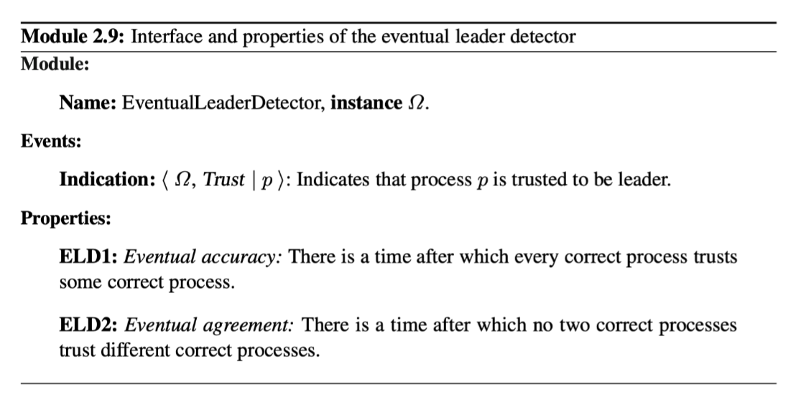
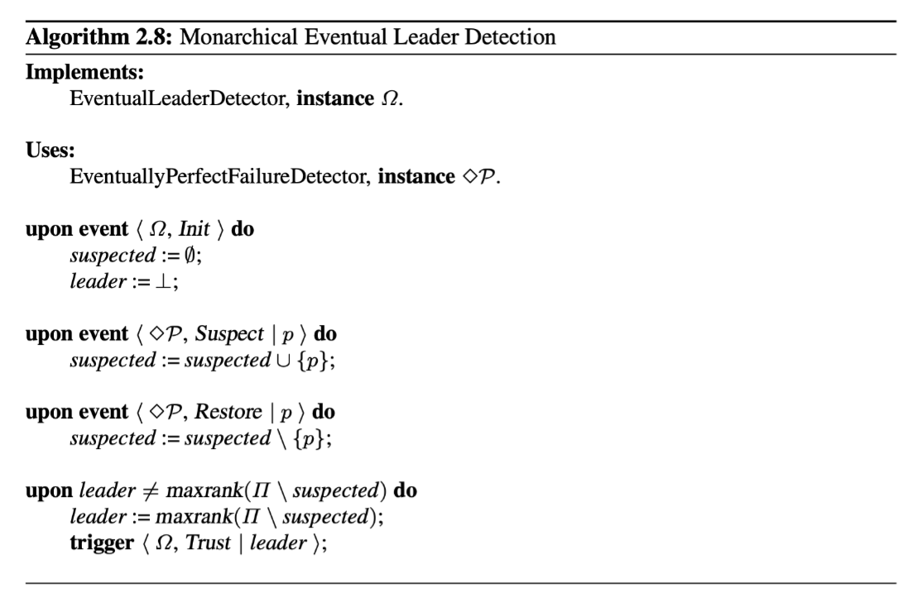

- [Abstracting Time](#abstracting-time)
  - [2. Perfect Failure Detection](#2-perfect-failure-detection)
    - [Specification. P](#specification-p)
  - [3. Leader Election](#3-leader-election)
    - [Specification.](#specification)
  - [4. Eventually Perfect Failure Detection](#4-eventually-perfect-failure-detection)
    - [Specification.](#specification-1)
  - [5. Eventual Leader Election](#5-eventual-leader-election)
    - [Specification.](#specification-2)
    - [Eventual leader-election implemented with Eventual Perfect Failure Detector](#eventual-leader-election-implemented-with-eventual-perfect-failure-detector)
## Abstracting Time

### 2. Perfect Failure Detection

In synchronous systems, and assuming a crash-stop process abstraction, crashes can be accurately detected using **timeouts**.

We encapsulate such a way of detecting failures for synchronous systems in a *perfect failure-detector* abstraction.

#### Specification. P

To detect the crash of a process p. the failure detector triggers an event <Crash|*p*> with argument *p*. The perfect failure detector never changes its mind and detections are permanent; in other words, once a process *p* is detected (to have crashed) by some process *q.* The process *p* remains detected by *q* forever.

### 3. Leader Election

Often one may not need to detect which processes have failed, but rather need to identify one process that has **not failed.** This process may then act as the **leader** that coordinates some steps of a distributed algorithm, and in a sense it is **trusted** by the other processes to act as their leader.

The leader-election abstraction can be implemented in a straightforward way from a perfect failure detector.

We consider the leader-election abstraction only for crash-stop process abstractions; it cannot be formulated for crash-recovery and arbitrary-fault process abstractions.

The abstraction is particularly useful in a **primary-backup** replication scheme, for instance. Following this scheme, a set of replica processes coordinate their activities to provide the illusion of a unique highly available service that tolerates faults of some processes. Among the set of replica processes, one is chosen as the leader. This leader process, sometimes called the primary, treats the requests submitted by the client processes on behalf of the other replicas, called backups. Before the leader returns a reply to a given client, it updates the backups.

**If the leader crashes, one of the backups is elected as the new leader.**

 #### Specification. 

We define the leader-election abstraction in terms of a specific < Leader | *p* >indication event. When triggered with a parameter p at some given time, it means that process p is electied as leader from that time on until it crashes. 

### 4. Eventually Perfect Failure Detection

We can encapsulate timing assumptions of a partially synchronous system within an *eventually perfecr failure detector* abstraction.

#### Specification. 

An eventually perfect failure-detector abstraction detects crashes accurately after some a priori unknown point in time, but may make mistakes before that time.

-> This captures the intuition that, most of the time, timeout delays can be adjusted so they can lead to accurately detecting crashes. However, there are periods where the asynchrony of the underlying system prevents failure detection to be accurate and leads to false suspicions.  In this case, we talk about failure suspicion instead of failure detection.

A process p may suspect a process q, even if q has not crashed, simply because the timeout delay chosen by p to suspect the crash of q was too short. In this case, p's suspicion about q is false. When p receives a message from q, p revises its judement and stops suspecting q. Process p also increases its timeout delay; this is because p does not know what the bound on communication delay will eventually be; it only knows there will be one.

Clearly, if q now crashes, p will eventually suspect q and will never revise its judgment. If q does not crash then there is a time after which p will stop suspecting q (i.e the timeout delay used by p to suspect q will eventually be large enough because p keeps increasing it whenever it commits a false suspoicion)

最开始的timeout设置的很短, 所以最开始p可以怀疑q, 不过当p收到q的消息,会修改它的判断,更新timeout.

### 5. Eventual Leader Election

3.perfect election abstraction 必须要求perfect failure detection.

Instead, we can implement a weaker notion of leader election -> ensures the uniqueness of the leader *only eventually*.

An eventual leader-election abstraction can also be implemented with crash-recovery and arbitrary-fault process abstractions.

#### Specification. 

Many leaders might be elected during the same period fo time without having crashed. Once a unique leader is determined, and does not change agiain, we say that the leader has *stabilized*. 

#### Eventual leader-election implemented with Eventual Perfect Failure Detector 

Algorithm 2.8, called “Monarchical Eventual Leader Detection,” implements Ω using the same approach as used in Algorithm 2.6 (“Monarchical Leader Election”), with the only difference that **deaths in the royal family are not final**. The algorithm maintains the set of processes that are suspected by <>P and declares the nonsuspected process with the highest rank to be the leader. **Eventually**, and provided at least one process is correct, the same correct process will be trusted by all correct processes.