# Group Membership

## 概念:

***install view:*** the processes are informed about failures

***coordinated:*** the processes install the same sequence of views.

***:***

## Overview.

**Throwback**: Some of our algorithms from the previous sections were required to make decisions based on information about which processes were operational, crashed, or otherwise faulty. At any point during the computation, every process maintains information about some other process, whether they are up and running, whether one specific process can be a trusted leader, and so on.

In the algorithms we considered, this information is provided by a failure detector module available at each process. According to the properties of a failure, this information reflects the actual status of failures in the system more or less accurately. In any case, the outputs of the failure detector modules at different processes are not always the same

In particular, different processes may get notifications about process failures **in different order** and in this way, obtain a different perspective of the system's evolution. If there was a way to provide better coordinated failure notifications, faster and simpler algorithms might become possible.

总之, 之前提醒系统中进程的错误, 每个进程接收到的提醒可能顺序不同, 这**not coordinated**, 我们想考虑能让每个进程接收到同样顺序的错误报告.

A group membership (GM) abstraction:

1. provides consistent and accurate information about which processes have crashed and which processes are correct.
2. a membership abstraction enables dynamic changes in the group of processes that constitute the system.A group membership primitive also coordinates such join and leave operations and provides a dynamic set of processes in the system. As with failure notifications, it is desirable that group-membership information is provided to the processes in a consistent way.

接下来的讨论集中于第一点: to give consistent information about process crashes in a system with static membership.

- In many distributed applications, processes need to know which processes are **participating** in the computation and which are not.
- Failure detectors proveide such information; however, that information is **not coordinated** even if the failure detector is perfect? 

(not coordinated 是什么意思?)

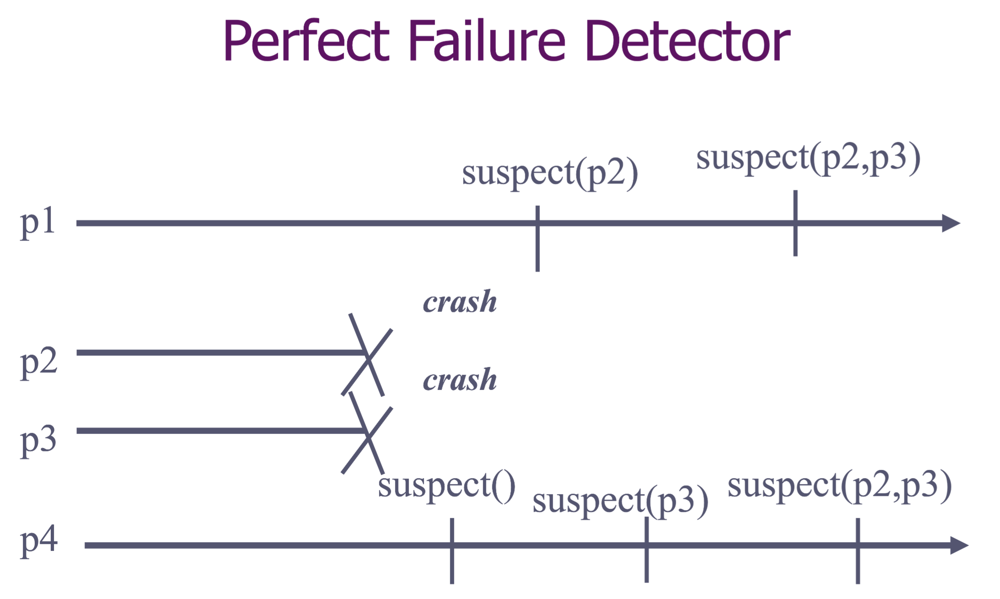

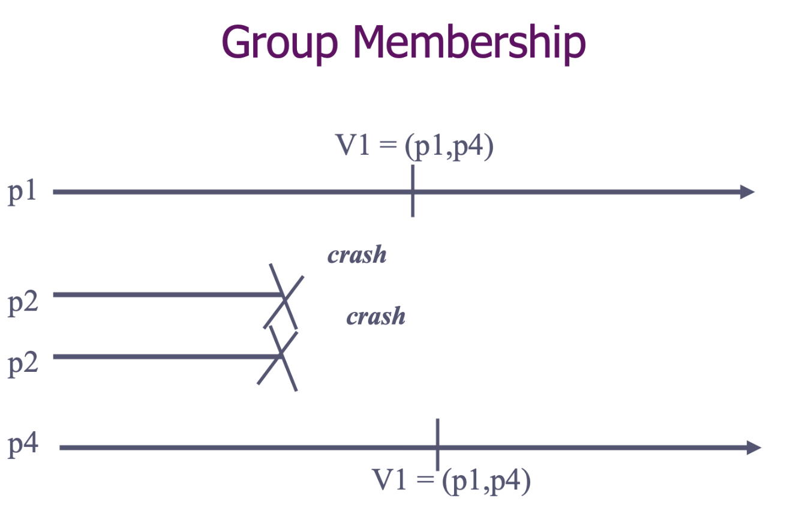

- To illustrate the concept, we focus on a ***group membership abstraction*** to coordinate the information about **crashes**.
- In general, a group membership abstraction can also typically be sued to coordinate the processes ***joinning*** and  ***leaving*** explicity the set of processes.(i.e. without crashes)

- Like with a failure detector, the processes are informed about failures; we say that the processes ***install views*** (view.id, view.memb)

- Like with a perfect failure detector, the processes have accurate knowledge about failures.
- Unlike with a perfect failure detector, the information about failures are ***coordinated***: the processes install the same sequence of views.

## Properties

***Memb1. Local Monotonicity:*** If a process installs view (j, M) after install (k, N), then j > k and M <N    ((??) 在(k, N)先,  (j, M)后  -> 暂时的理解, k, j是表示先后的顺序, N和M值的是正确process集合?) 

***Memb2. Agreement:*** No two processes install views (j, M) and (j, M') such that M != M'

***Memb3. Completeness:*** If a process p crashes, then there is an integer j such that every correct process eventually installs view(j, M) such that p !$\in$ M( 不属于)

***Memb4. Accuracy:*** If some process installs a view (i, M) and p !$\in$ M, then p has crashes.

## Algorithm: Group Membership

初始时有一个view -> 检测到crash -> 共识算法 把crash的p排除 -> 产生新的view

### 1. Specification

a view V = (id, M) is a tuple that contains a unique numeric ***view identifier id and a set M of view member processes***.

When  a process outputs a view V, it is said to *install* a new view V, after going through *a view change*. Group membership offers no request events to the layer above.

textbook version: 

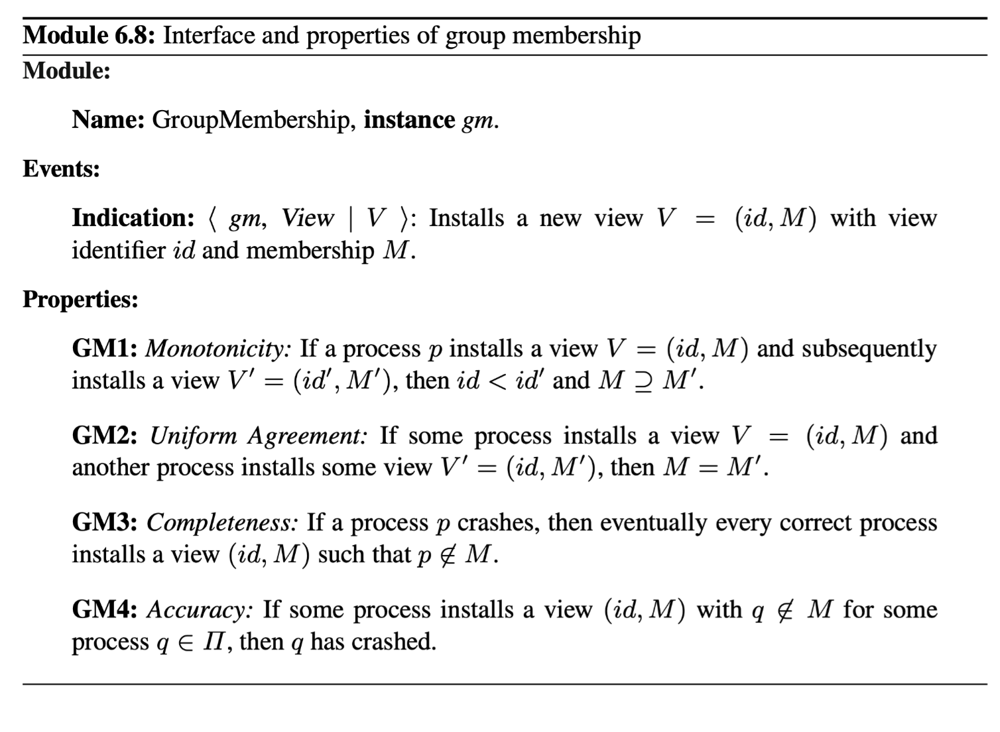

change 2

### 2. Implementation

- At initialization, each process installs a view including **all the processes in the system**. From that point on, the algorithm remains idle until some process detects that another process has crashed. 

- As different processes may detect crashes in different orders, **a new view cannot be output immediately after detecting a failure and in a unilateral way**; the processes first need to coordinate about the composition of the new view. The algorithm executes **an instance of uniform consensus to decide which processes are to be included in the next view**. A process invokes consensus only after it has detected that at least one member of the current view have crashed. 

- The ***wait*** flag is used to prevent a process from triggering a new consensus instance before the previous consensus instance has terminated. 
- When the consensus decides, a new view is delivered. In order to preserve the uniform agreement property, **a process p may sometimes install a view containing a process that p already knows to have crashed**, because the perfect failure-detector module at p has already output that process. In this case, after installing that view, p will initiate a new consensus instance to trigger the installation of another view that would exclude the crashed process. 刻意加一个已经知道crash的来触发uniform consensus

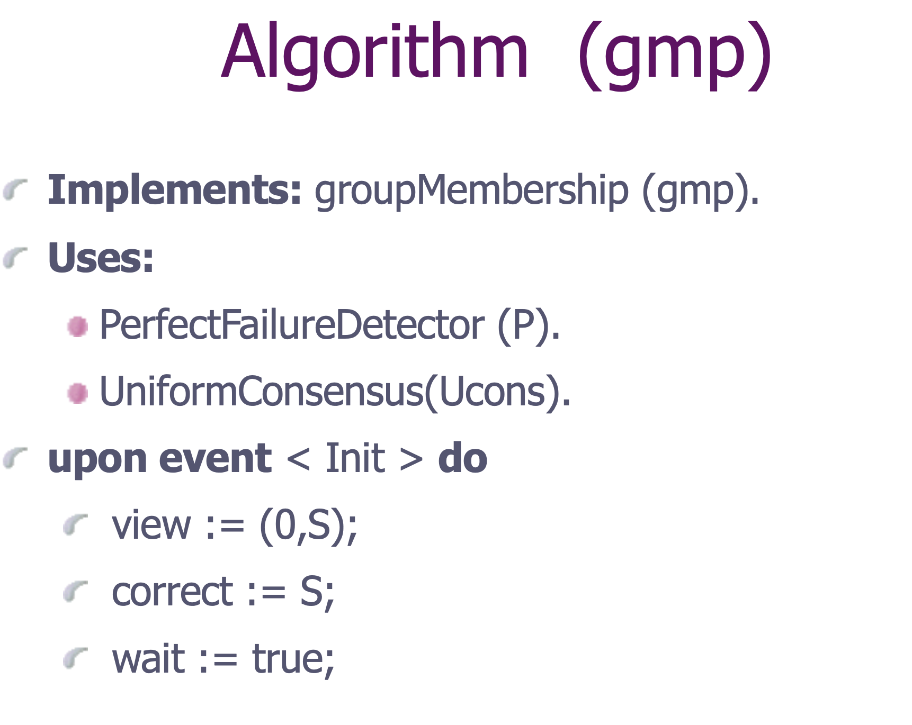

The initial group view is the entire system.

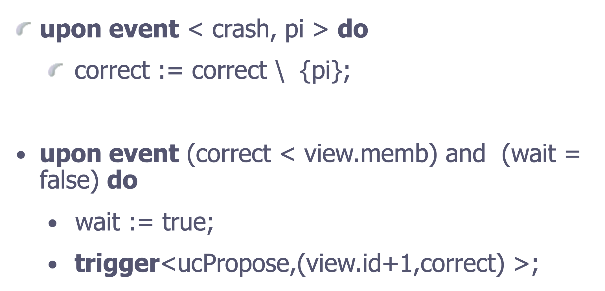

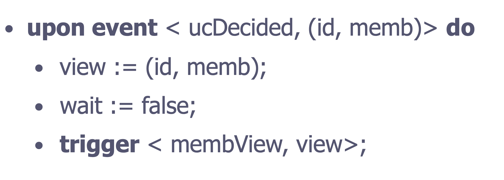

- 维护三个变量 view; correct; wait
- 初始时, view为(0, S), coorect为S, S代表初始整个processes set, wait 为 true 表示需要等待
- pi遇到了crash事件, 就将pi移出correct
- 如果wait等于false了, 同时当前correct的process 数量 又小于当前 view的member 数量.(这个是什么情况? -> 说明有crash的进程被发现, 被移除出correct, 那么此时就该propose 新的更新信息) 那么就将wait设为false, 然后触发<ucPropose, (view.id+1, correct)> 
- 我对event-based 算法的理解是否正确? 比如我们想要ucDecided当前的view, 那就先将当前的view赋值, 然后将wait 变为false, 此时 就会判断是否 correct <  view.memb 来看是否trigger<ucPropose> 然后 trigger<membView, view> -> 这是啥事件? 就是生成新的view

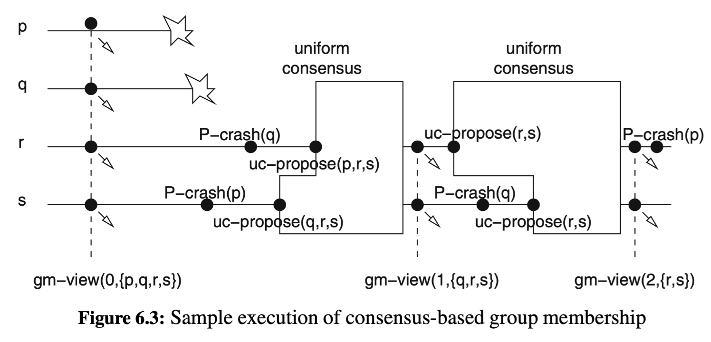

- s先检测到p crash了 -> initiates a consensus instance to define a new view without p.
- r 然后检测到 q crashes, ->initiates a consensus instance to define a new view without q.
- The first consensus instance decides the proposal from **s**. -> p 被踢走 新的view id 为1
- r检测到q的crash 所以it triggers another consensus instance to exclude q. 
- Eventually, process s also detects the crash of q and also participates in the second consensus instance to install the view with identifier 2.

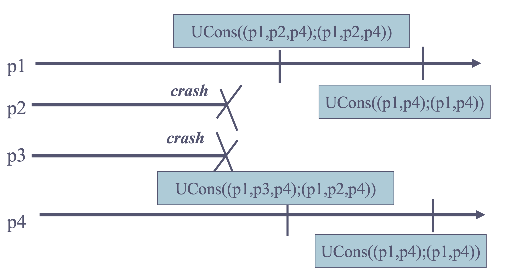

 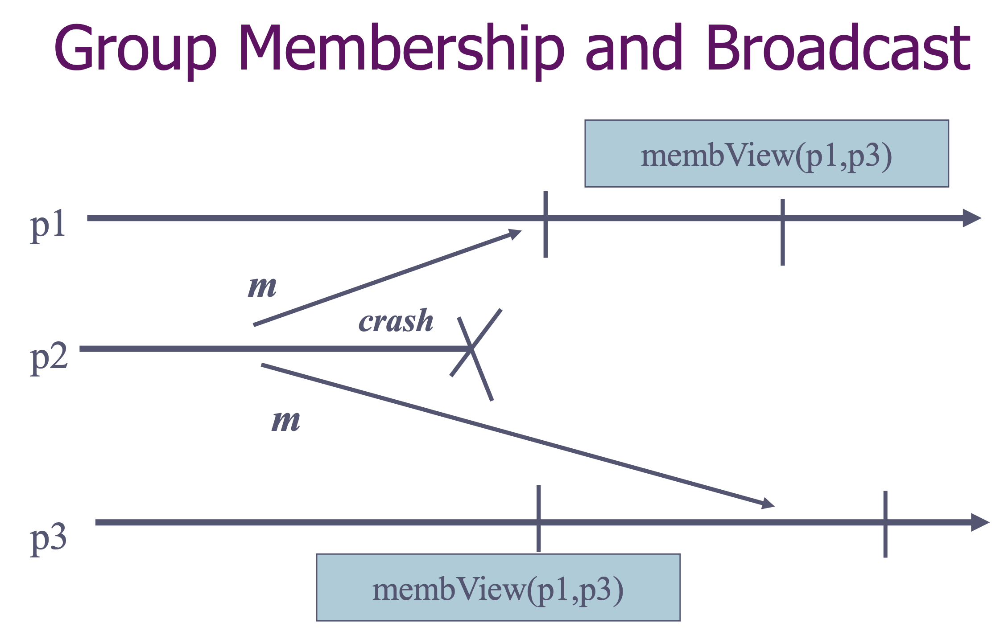

# View Synchrony

## Overview

出现问题的场景: 一个进程q广播m, 并且被一些processes deliver了,但是之后q crashes 了, 并且被检测到,进行共识算法, 生成不包含q的 new view.

 

***Scenario***:  

a group of processes exchanging messages -> one of them, say process q crashes.

Assume that this failure is detected and that the membership abstraction installs a new view V = (id, M) at the processes such that q !$\in$ M.

Suppose that after V has been installed, some process p delivers a message m that was originally broadcast by q.

-> Note that such a scenario is possible, as nothing in the sepcification of reliable broadcast prevents a message that was broadcast by a process that has failed from being delivered later.

-> In fact, in order to ensure the agreement property of reliable broadcast, message originally broadcast by q are typically relayed by other processes, especially for the caser where q has failed.

但是, 对于application programmer来说收到这样的消息很奇怪. 

Thus, be desirable for p to simply discard m. -> Unfortunately, it may also happen that some other process r has already delivered m before installing view V.

-> Therefore, in this scenario, 2 conflicting goals:

1. **Ensure the reliability of the broadcast, which means that m must be delivered by p**
2. **But at the same time, to guarantee the consistency of the view information, which means that m cannot be delivered in the new view and p must discard it.**

**View Synchronous Broadcast** is an abstraction that results from the combination of group membership and reliable broadcast. *Group membership + reliable broadcast*

**View Synchronous Broadcast** ensures that the delivery of messages is coordinated with the installation of views.

**View Synchronous communication** integrates the installation of views with the delivery of messages and orders every new view with respect to the message flow. **If a *message* is delivered by a (correct) process before it installa a view V then m should be delivered by all processes that install V, *before* they install the view.** 

-> 如果一个(correct) process 在 install a view 前 delivered了m, 那么m应该被所有install此View的processes deliver, 不过要在install之前.

<u>***本质就是在m被deliver时, broadcast m的那个进程应该被包含在当前view的M里***</u>

## Property

- Group Membership (**Memb1 - Memb4**) 
- **reliable broadcast(RB1-RB4)**

- **VS:** a message is ***vsDelivered*** in the view where it is ***vsBroadcast*** 

  (换一种表达方式: VS1: View Inclusion: If some process delivers a message m from process p in view V, then m was broadcast by p in view V.) **This *view inclusion* property requires that every message must be delivered only in the same view in that it was broadcast.**

  This solves the problem mentioned before, as the condition implies that messages coming from processes that have already been excluded from a view can no longer be delivered

## Algorithms

### 1. Specifications

<u>View-Synchronous : **Reliable Broadcast Abstraction + Group Membership Abstraction**</u>

Overall: View-synchronous communication extends both the reliable broadcast abstraction and the group membership abstraction: as a consequence, its interface contains the events of both primitives.

Specifically, the interface of a view-synchronous communication primitive contains:

**a request event *<Broadcast | m>***: to broadcast a message m

an **indication event < Deliver | p, m>** : that outputs a message m from sender p 

another **indication event < View | V>** : which installs view V. 

The abstraction adds **two more events < Block > , < BlockOk >  ** used for synchronization with the communication layer above. The abstraction adds two more events used for synchronization with the communication layer above. 

**<u>*基本算法思路*</u>** In order to make the *view inclusion* property feasible, the interface and properties of view-synchronous communication contain **an additional feature**.  -> **As messages must be delivered in the same view in which they are broadcast** **(一个消息被broadcast和deliver时 的view应该是同一个),**  **<u>*但是会造成的问题*</u>**-> the view change poses a problem: **if new messages are continuously broadcast then the installation of a new view may be postponded indefinitely.**(如果一直有广播, 那么install view这个操作就会被无限期推迟.)

**<u>*解决思路*</u>**

 -> It is not possible to implement the view-synchronous communication abstraction without any control on the broadcast pattern.

-> Therefore, the interface of this abstraction **includes two specific events** that handle the interaction between the view-synchronous communication primitive and the layer above. (i.e. the application layer). **They provide flow control through a < Block> indication event and a < BlockOk> request event.**

**Flow Control**-> By triggering the < Block> event, the view-synchronous communication layer requests that the higher layer stops broadcasting messages in the current view. 叫上层: 你别再发啦!!  When the higher-level module agrees to that, it acknowledges the block request with the < BlockOk> event.

In summary,

- We assume that the layer above is well behaved and that whenever it is asked to stop broadcasting messages (through a request to block), then it indeed does not trigger any further broadcasts after acknowledging the request to block. **It may again broadcast new messages after the next view is installed.**
- We require from the view-synchronous communication abstraction that it only requests the higher layer to block if a view change is imminent.

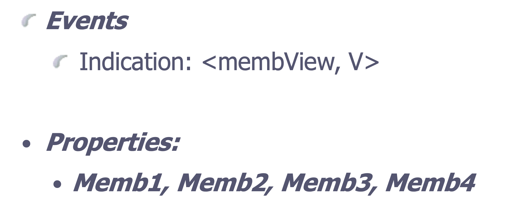

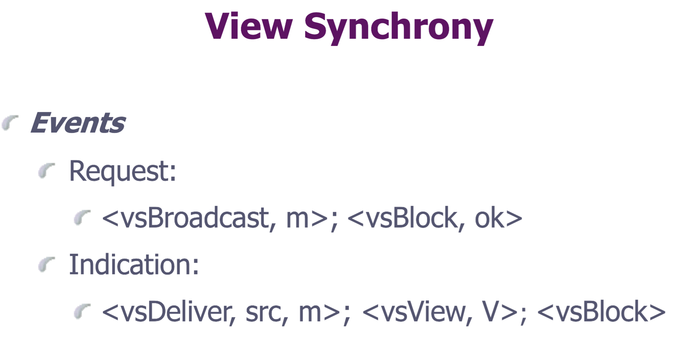

### Fail-Stop Algorithm: TRB-Based View-Synchronous Communication

**The key element of the algorithm is a collective *flush* procedure, executed by the processes after they receive a view change from the underlying group membership primitive and before they install this new view at the view-synchronous communication level**.

During this step, every process uses an instance of the uniform TRB primitive to rebroadcast all messages that it has view-synchronously delivered in the current view.

算法概述: 

- The algorithm for an instance vs of view-synchronous communication works as follows. During its normal operation within **a view V = (vid, M)**, a process simply adds ***vid*** to every message that it receives for vs-broadcast and broadcasts it in a DATA message using an underlying best-effort broadcast primitive beb. <u>进程每收到一条消息, 将vid附上用来vs-broadcast, 然后用beb广播.</u>

- When a process beb-delivers a DATA message with a view identifier that matches vid, the identifier of the current view, it immediately **vs-delivers** the message contained inside. 当beb deliver <u>对应消息的vid 和我们view的vid匹配, 那就vs-deliver</u>
- Every process also maintains a set ***inview***, with all sender/message pairs for the messages that it vs-delivered during the normal operation of the current view. <u>保存当前view内 所有vs-deliver的 sender/message对</u>

- flush procedure is initiate when installs a new view ->

  每个process 向它的caller请问stops vs-broadcasting messages in current view. ->

  高层允许, 在每个进程回以< BlockOk> event. ->

  当view-synchronous communicaiton algorithm receives this event, 它停止vs-delivering new messages 并且discards 通过beb到达的任何 DATA 消息. -> 

  The process then proceeds to resending all message that it vs-delivered in the old view using a TRB primitive.

  

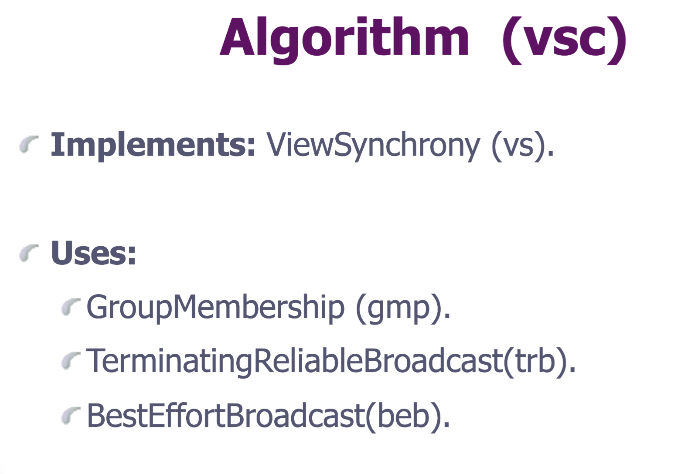

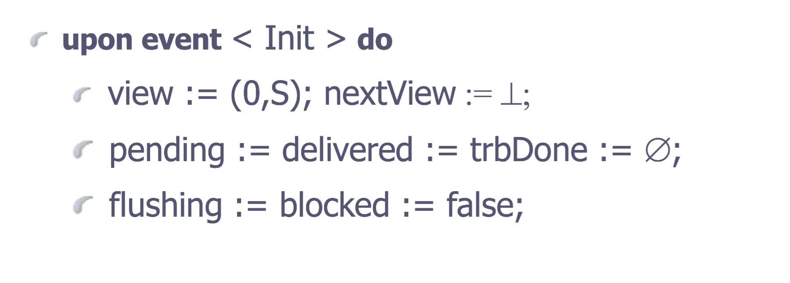

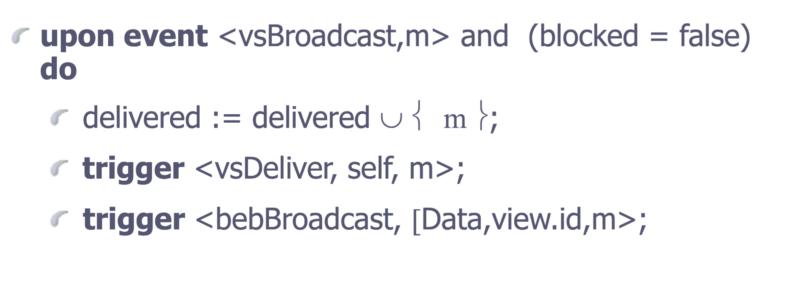

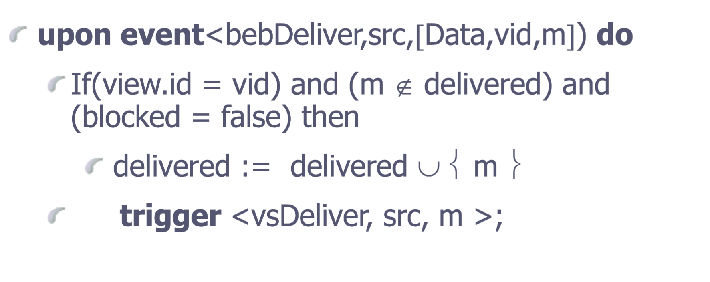

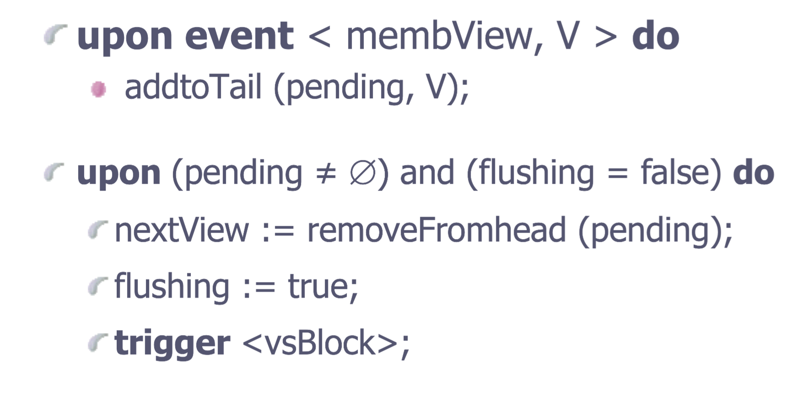

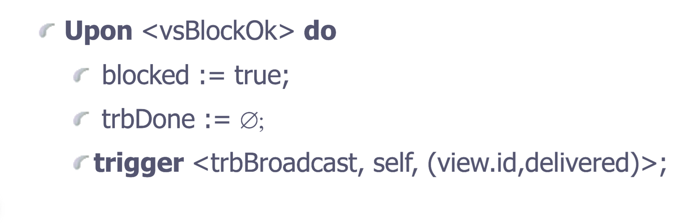

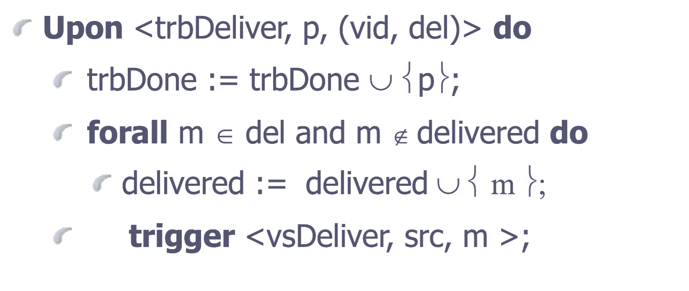

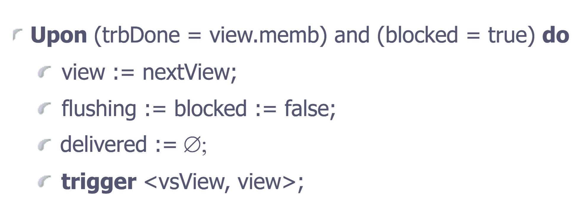