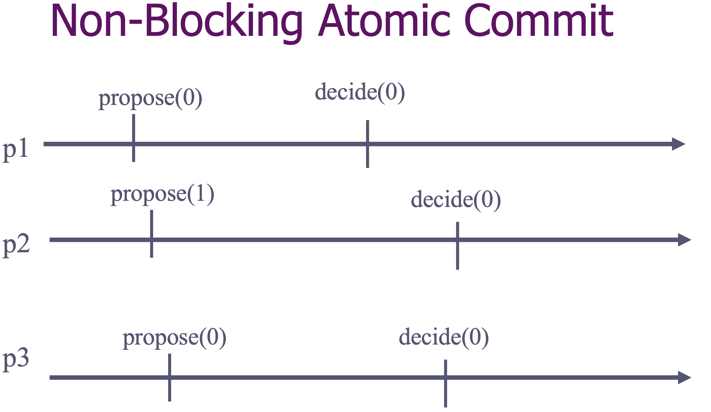

- [1. Transcations](#1-transcations)
- [2. ACID Properties](#2-acid-properties)
- [3. Non-Blocking Atomic Commit](#3-non-blocking-atomic-commit)
- [4. NBAC Property](#4-nbac-property)
- [5. Implementation](#5-implementation)
	- [5.1. Specification](#51-specification)
	- [5.2. Fail-Stop Algorithm: Consensus-Based Nonblocking Atomic Commit](#52-fail-stop-algorithm-consensus-based-nonblocking-atomic-commit)
	- [5.3. Do we need Perfect failure detector P?](#53-do-we-need-perfect-failure-detector-p)

Decide(0-1) ? 

UCons(0, 0-1)?

课件里的这些图例 不是特别明白

## 1. Transcations

- A transaction is an atomic program describing a sequence of accesses to shared and distributed information.
- A transaction can be terminated either by ***committing or aborting***

数据库事务**Transaction**是数据库管理系统Database management system **(DBMS)** 执行过程中的一个逻辑单位, 由一个有限的数据库操作序列构成. -> The unit of data processing in a distributed information system is a *transaction*.

A transaction typically satisfies *atomic* semantics in two senses:

- **Concurrency atomicity**: All transcations appear to execute one after the other, i.e. they are *serializable*; serializability is usually guaranteed through some *distributed locking* scheme or with some *optimistic concurrency control* mechanism.

- **Failure atomicity**: Every transaction appears to execute either completely(**commit**) or not at all (**abort**).

Ensuring these two forms of atomicity in a distributed environment is not trivial because the transaction might be accessing information on different processes, call **data managers**( that is what we call **processes** in NBAC abstraction), which maintain the relevant data items.

- The data managers may have different **local state** and different opinions on whether the transaction should commit or not. i.e. Some data managers might observe conflicting concurrent data accesses, whereas others might not. 

- The data managers might detect logical or physical problems that prevent a transaction from committing. i.e. There may not be enough money to make a bank transfer, there may be concurrency-control problems, such as the risk of violating serializability in a database system.

Despite differences between their opionions, all data managers need to make sure that they either all discard the new updates(in case the transaction aborts) or make them visible(in case the transaction commits. **agree on same outcome**.

事务是并发控制的基本单位. 所谓的事务, 是一个操作序列, 这些操作**要么都执行, 要么都不执行, 它是一个不可分割的工作单位**. 例如, 银行转账工作: 从一个账号扣款并使另一个账号增款, 这两个操作要么都执行, 要么都不执行, 在关系数据库中, 一个事务可以是一条SQL语句, 一组SQL语句或整个程序. 所以, 应该把它们看成一个事务. 事务是数据库维护数据一致性的单位, 在每个事务结束时, 都能保持数据一致性.

**Transactions**

	beginTransaction
		- Pierre.credit(1.000.000)
		- Paul.debit(1.000.000)
	outcome := commitTransaction
	if(outcome = abort) then ...

一个数据库事务通常包含了**一个序列的对数据库的读/写操作**。它的存在包含有以下两个目的：

1. 为数据库操作序列提供了一个从失败中恢复到正常状态的方法，同时提供了数据库即使在异常状态下仍能保持一致性的方法。 ***Consistency***
2. 当多个[应用程序](https://baike.baidu.com/item/应用程序)在[并发](https://baike.baidu.com/item/并发)访问数据库时，可以在这些应用程序之间提供一个隔离方法，以防止彼此的操作互相干扰。 ***Isolation***

当事务被提交给了[DBMS](https://baike.baidu.com/item/DBMS)（[数据库管理系统](https://baike.baidu.com/item/数据库管理系统)），则[DBMS](https://baike.baidu.com/item/DBMS)（[数据库管理系统](https://baike.baidu.com/item/数据库管理系统)）需要确保该事务中的所有操作都成功完成且其结果被永久保存在数据库中***Durability***，如果事务中有的操作没有成功完成，则事务中的所有操作都需要被[回滚](https://baike.baidu.com/item/回滚)，回到事务执行前的状态;同时，该事务对数据库或者其他事务的执行无影响，所有的事务都好像在独立的运行。***Isolation***

但在现实情况下，失败的风险很高。在一个数据库事务的执行过程中，有可能会遇上事务操作失败、[数据库系统](https://baike.baidu.com/item/数据库系统)/[操作系统](https://baike.baidu.com/item/操作系统)失败，甚至是存储介质失败等情况。这便需要[DBMS](https://baike.baidu.com/item/DBMS)对一个执行失败的事务执行恢复操作，将其数据库状态恢复到一致状态（数据的[一致性](https://baike.baidu.com/item/一致性)得到保证的状态）。为了实现将数据库状态恢复到一致状态的功能，[DBMS](https://baike.baidu.com/item/DBMS)通常需要维护[事务日志](https://baike.baidu.com/item/事务日志)以追踪事务中所有影响数据库数据的操作。

## 2. ACID Properties

**Atomicity:** a transaction either performs entirely or none at all.

**Consistency:** a transaction transforms a consistent state into another consistent state

**Isolation:** a transaction appears to be executed in isolation

**Durability:** the effects of a transaction that commits are permanent.

## 3. Non-Blocking Atomic Commit

The ***nonblocking atomic commit(NBAC)*** abstraction is used precisely to solve this problem in a reliable way. The processes, each representing a data manager, agree on the outcome of a transaction, which is either to *commit* or to *abort* the transaction. Every process initially proposes a value for this decision, which is either a *Commit* value or an *Abort* value, depending on its *local state* and *opinion* about the transaction.

- As in consensus, every process has an initial value 0 (no) or 1(yes) and must decide on a final value 0 (abort) or 1 (commit)
- The proposition means the ability to commit the transaction
- The decision reflects the contract with the user
- Unlike consensus, the processes here seek to decide1 but every process has a vote right

## 4. NBAC Property

**NBAC1. Agreement**: No two processes decide differently 

**NBAC2. Termination**: Every correct process eventually decides

**NBAC3. Commit-Validity**: 1 can only be decided if all processes propose 1

**NBAC4. Abort-Validity**: 0 can only be decided if some process crashes or votes 0

所有进程都提出1, 1才能被decided. 任何进程crashes 或者 投0 那么就decide 0.

## 5. Implementation

### 5.1. Specification

This abstraction is defined by ***Propose*** ***Decide***, which are similar to those in the interface of the consensus abstraction, but require that v is either *Commit* or  *Abort*. 

算法是否就简单的是: binary consensus: the processes propose one of two values and need to decide on a common final value? 

Difference: in consensus, any proposed value can be decided. In the **atomic commit** abstraction, a value of *Commit* cannot be decided if any of the processes has proposed *Abort*. When a process expresses its veto to a transaction by proposing *Abort*, the NBAC abstraction must honor this. 

As another difference to consensus, **nonblocking atomic commit** may decide *Abort* also if some process crashes, even though all processes have proposed *Commit*.

### 5.2. Fail-Stop Algorithm: Consensus-Based Nonblocking Atomic Commit

In order to distinguish the value proposed to the NBAC abstraction from the value proposed to the underlying consensus abstraction, we call the first a **vote**, and the second a **proposal**.

The algorithm works as follows: 

- Every process p broadcasts its initial vote(Abort or Commit) to all other processes using beb. 
- it waits to hear something from every process q in the system: either to beb-deliver the vote of q or to detect the crash of q. If p detects the crash of any process or receives a vote *Abort* from any process then p directly(without waiting for more messages) invokes the consensus abstraction with *Abort* as its proposal. If p receives the vote Commit from all processes then p invokes consensus with Commit as its proposal. 
- Once the consensus abstraction uc-decides, every process nbac-decides according to the outcome of consensus.

初始化prop为1; 最开始时pi propose一个值, beb给所有processes, 如果出现crash了,就将pi从correct从排出,  对每个process, bebDeliver v, 这时prop的值就是 prop * v, 如果prop为1(也是初始设置), 那就为v. 如果correct 减去delivered为空, 两种可能, 第一种没有correct 那就prop为0, 另外一种就是correct和deliver都完全一样, 那就uncPropose.

### 5.3. Do we need Perfect failure detector P?

1. <> P is not enough

   

   

   

2. P is needed if one process can crash

