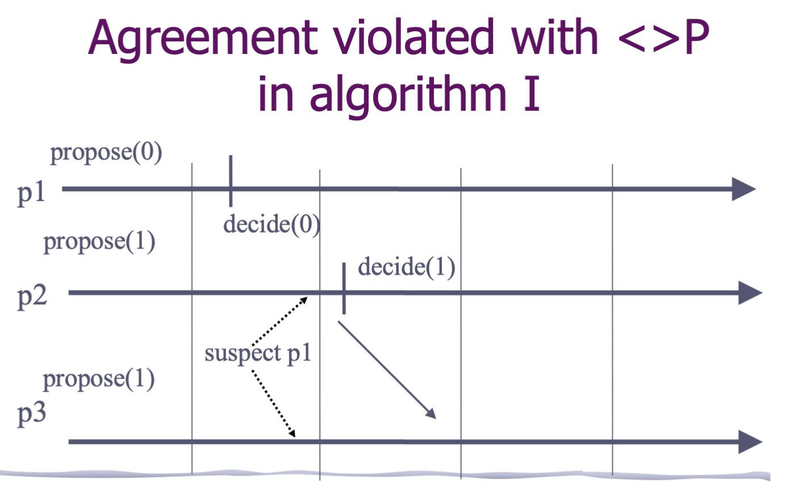
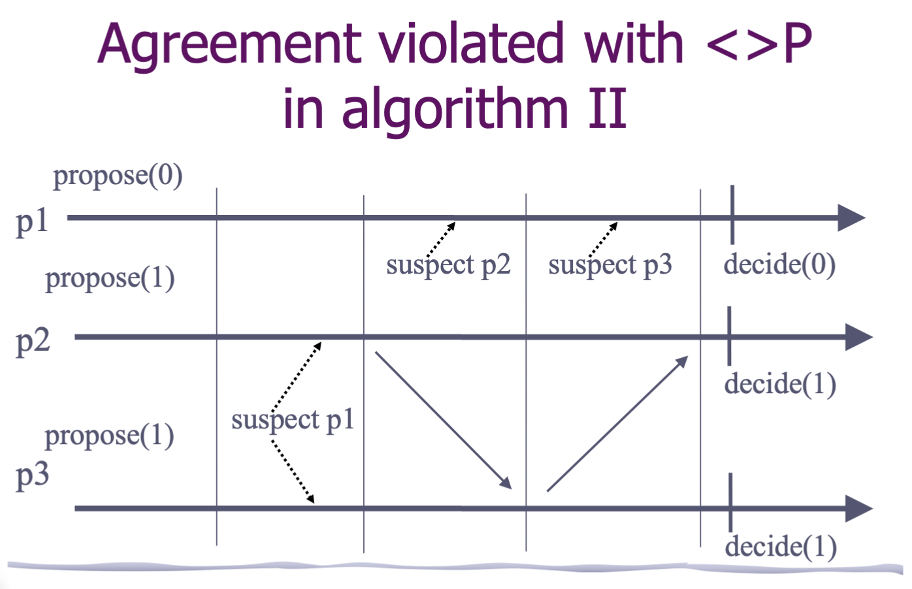
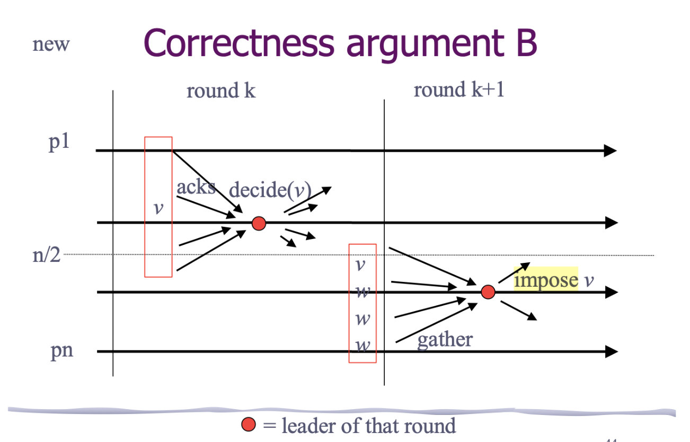

# DistributedAlgorithms

# Consensus- [DistributedAlgorithms](#distributedalgorithms)
- [DistributedAlgorithms](#distributedalgorithms)
- [Consensus- DistributedAlgorithms](#consensus--distributedalgorithms)
    - [Summary](#summary)
  - [Introduction](#introduction)
    - [System Model](#system-model)
      - [Network model](#network-model)
        - [- Synchronous](#--synchronous)
        - [- Asynchronous](#--asynchronous)
      - [Failure Model](#failure-model)
      - [Message Model](#message-model)
  - [Consensus](#consensus)
    - [(Regular) Consensus](#regular-consensus)
      - [(1) Property](#1-property)
      - [(2) Regular Consensus Fail-Stop Model Overview](#2-regular-consensus-fail-stop-model-overview)
      - [(3) Regular Consensus Fail-Stop Model Implementation](#3-regular-consensus-fail-stop-model-implementation)
      - [(4) Correctness argument](#4-correctness-argument)
      - [上述算法或许可能出现的问题? (课程外)](#上述算法或许可能出现的问题-课程外)
    - [Uniform Consensus Algorithm II](#uniform-consensus-algorithm-ii)
      - [(1) Property](#1-property-1)
      - [(2) Overview](#2-overview)
      - [(3) Implementation](#3-implementation)
      - [(4) Correctness Argument](#4-correctness-argument-1)
        - [A.](#a)
        - [B. Uniform Agreement](#b-uniform-agreement)
    - [Uniform Consensus Algorithm III](#uniform-consensus-algorithm-iii)
      - [(1). Overview](#1-overview)
      - [(2). Consensus algorithm III](#2-consensus-algorithm-iii)
      - [(3). Correctness argument](#3-correctness-argument)
        - [Correctness argument A](#correctness-argument-a)
        - [Correctness argument B](#correctness-argument-b)
      - [(4). Agreement is never violated (???????)](#4-agreement-is-never-violated-)

### Summary

- (Uniform) Consensus problem is an important problem to maintain consistency
- Three algorithms: 
  - I: consensus using P
  - II: uniform consensus using P
  - III: unform consensus using <>P and a creect majority.

In the consensus problem, the processes propose values(Here we consider Single value consensus) and have to agree on one among these values.

Solving Consensus is key to solving:

1. Total order broadcast(aka Atomic broadcast)
2. Atomic commit(in database)
3. Terminating reliable broadcast: The process knows the broadcast has been terminated.
4. Dynamic group membership: The number and identity of the process in a group can be changed overtime and they have to agree who is in the group and who is not.
5. Stronger shared store models.

## Introduction

Alice: Where are we go today?

Bob: Let's go to Paris!     ->**Propose**

Alice&Ceris: Great! Let's go!  -> **Agree**

-> Then **Decide**

To describe a consensus problem: A distributed system consists of n processes : {0, 1, 2, 3, ..., n-1}. Each process has a value and they can communicate with each other. What we do is to design an algorithm that even some process crashes or fails, processes still decide on one single value and every execution satisfies these 4 properties: 

1. **C1. Validity**: Any value **decided** is a value proposed.
2. **C2.Agreement**: No two **correct** processes decide differently.
3. **C3.Termination**: Every correct process **eventually decides**.
4. **C4.Integrity**: No process decides twice.

### System Model

#### Network model

##### - Synchronous

响应时间是在一个固定且已知的有限范围内.

##### - Asynchronous

响应时间是无限的.

在一个分布式异步系统中,即使只有一个进程出现了故障, 也没有算法能保证共识. 这是因为, 在异步系统中, 进程可以随时发出响应,所以没有办法分辨一个进程是速度很慢还是已经崩溃, 这不满足终止性Termination.

因此,分布式共识算法需要具有两个属性-> Safety 和 liveness.

Safety: Every correct process decides on one value.

Liveness: 分布式系统最终回认同某一个值.

因此,每个共识算法要么牺牲掉一个属性, 要么放宽对网络异步的假设.

**FLP Impossible**: 指无法确保达成共识, 并不是说如果有一个进程出错, 就永远无法达成共识. *这种不可能的结果来自于算法流程中最坏的结果*:

1. 一个完全异步的系统
2. 发生了故障
3. 最后, 不可能有一个确定的共识算法

针对这些最坏的情况, 可以找到一些方法, 尽可能去绕过FLP Impossible, 能满足大部分情况下都能达成共识,一下是常用的方法:

1. Fault masking
2. Failure detectors
3. Non-Determinism 随机性算法

#### Failure Model

1. Fail-Stop Failures: 节点突然宕机并停止响应其他节点
2. Byzantine Failures: 源自拜占庭将军问题, 指节点响应的数据可能会产生无法预料的后果. 可能会相互矛盾或完全没有意义, 这个节点甚至在说谎, 比如黑客入侵的节点.

#### Message Model

1. Oral Message: 消息在转述时可能被篡改
2. Signature Message: 消息被传出来后时无法被修改的, 一旦被篡改就会被发现.

## Consensus 

### (Regular) Consensus

#### (1) Property

1. **C1. Validity**: Any value **decided** is a value proposed.
2. **C2.Agreement**: No two **correct** processes decide differently.
3. **C3.Termination**: Every correct process **eventually decides**.
4. **C4.Integrity**: No process decides twice.

#### (2) Regular Consensus Fail-Stop Model Overview

- The processes exchange and update proposals in rounds and decide on the value of the non-suspected process with the smallest id.
- The processes go through rounds incrementally(1 to n): in each round, the process with the **id corresponding to that round is the leader** of the round.
- The leader of a round decides its current proposal and broadcasts it to all.
- A process that is not leader in a round waits(a) to deliver the proposal of the leader in that round to adopt it, or (b) to suspect the leader.

Summary: 

**Loop through rounds 1 to N, in round i**:

*1. process i is leader*:  broadcasts proposal v and decides proposal v.

*2. Other processes*: 

	- adopt i's proposal v and remember **currentProposal i**
	- Detect crash of i.

#### (3) Regular Consensus Fail-Stop Model Implementation

总结: 

**1. init** 初始化;

 **2. crash**: 检测故障; 

**3. Propose**: 如果没接受过别的proposal就自己propose一个;

**4. bebDeliver**: 接受该轮proposal; 

**5.已经deliver或是检测到crash**;

**6. Leader Propose**

​					*Set process's initial proposal, unless it has already adopted another node's*

​	

​	***delivered[round] = true or Pround in suspected**: Next round if deliver or crash*

​					Note: **- *Pround = self : If I am leader***

​								*- broadcast[round] = false -> trigger once per round*

​								*- currentProposal != nil: trigger if I have proposal*

​								*- trigger<Decide, currentProposal> : permanently decide.*

​						*如果我是leader, decide自己, 再将currentProposal beb给其他进程*

#### (4) Correctness argument

**How many failures it can tolerate?? -> N-1**

-> Basic idea: 

1. There must be a first correct leader P
2. P decides its value v and beb-casts v.
   1. every correct process adopts v 
   2. Future rounds will only propose v.

#### 上述算法或许可能出现的问题? (课程外)

在第一轮decide a 后就crash了, 但是对于p3 它收到p1的a比收到p2还晚, 所以它在第三轮propose了a, 而p2在propse b后就decide了. 所以最后correct的p2 p3 decide differently.

解决方式: **Invariant: only adopt "newer" than what you have.**

### Uniform Consensus Algorithm II

#### (1) Property

1. C1. Validity: Any value decided is a value proposed.
2. **C2.Agreement: No two processes decide differently.**
3. C3.Termination: Every correct process eventually decides
4. C4.Integrity: No process decides twice.

#### (2) Overview

- The processes go through rounds incrementally (1 to n): in each round I, process PI sends its currentProposal to all.
- A process adopts anty currentProposal it receives.
- Processes decide on their currentProposal values **at the end of round n.**

#### (3) Implementation

总结: 与Regular Consensus 的不同之处

(1): 多了一个变量**decided** 在init event中赋值为false

(2): 已经deliver或是检测到crash: 如果已经到第n轮并且还没decided 那就decide, 否则round + 1;

(3): If I am leader: 这个阶段不需要decide自己, 只需要将当前值beb给其他所有processes

#### (4) Correctness Argument

##### A. 

**Lemma: If a process pJ completes round I without receiving any message from pI and J > I, then pI crashes by the end of round J.**

Proof(?): 假设J > I, J 首先完成I 轮但是没有收到pI 的消息, 而pI又completes round J.  那么pJ 会在round I suspect pI.

因此, pI has crashed before pJ completes round I. 

所以在第J 轮, 要么 pI suspects pJ (不可能, 因为pI 已经crash了) 要么 pI receives round J message (也不可能因为I 已经crash了)

##### B. Uniform Agreement

Consider the process with the lowest id which decides, say pI. Thus, pI completes round n. By previous lemma, in round I, every pJ with J > I receives the currentProposal of pI and adopts it. Thus, every process which sends a message after round I or decides, has the same currentProposal at the end of round I.

### Uniform Consensus Algorithm III

#### (1). Overview

- A uniform consensus algorithm assuming: 
  - A correct majority
  - a <>P failure detector
- **Basic idea: the processes alternate in the role of a phase coordinator until one of them succeeds in imposing a decision.**
- <>P ensures: 
  - **Strong completeness**: Eventually every process that crashes is permanently suspected by all correct processes.
  - **Eventual strong accuracy**: Eventually no correct process is suspected by any process.

- "<>" makes a difference

  - **Eventual strong accuracy**: Eventually no correct process is suspected by any process.
  - Correct processes may be falsely suspected a finite number of times
  - This breaks consensus algorithms I and II

- Counter examples for algorithm I and II

  

和algorithm1冲突: p1 propose 并自己decide后 如果p2 p3 suspect p1, 那么p2就会也propose 它自己, 给p3, 这样就无法达成共识. **一旦decide无法改变**

​	

-> 

#### (2). Consensus algorithm III 

- The algorithm is also round-based: processes move incrementally from one round to the other
- Process pi is ***leader*** in every round k such that k mod N = I
- In such a round, pi ***tries to decide***

->

- pi succeeds if it is not suspected (processes that suspect pi inform pi and move to the next round; pi does so as well)

- If pi succeeds, pi sues a ***reliable broadcast*** to send the decision to all ( the reliability of the broadcast is important here to preclude the caser where pi crashes, some other processes delivers the messsage and stop while the rest keeps going without the majority)

  必须用reliable broadcast, 防止 pi crashes, 一些接受到, 一些没接受到.

- How does pi decide? -> pi executes steps 1-2-3

  - 1. Pi selects among a majority the latest adopted value (latest with respect to the round in which the value is adopted)
    2. pi imposes that value at a majority: any process in that majority adopts that value -pi fails if it is suspected.
    3. pi decides and braodcast the decision to all.

#### (3). Correctness argument 

##### Correctness argument A

- **Validity and integrity** are trivial
- Consider **termination**: (所有correct process最终都会decide吗?) -> if a correct process decides, it uses reliable broadcast to send to decision to all : every correct process decides.
  - Assume by contradiction that some process is correct and no correct process deicides. We argue that this is impossible.
- By the correct ***majority*** assumption and the  ***completeness*** property of the failure detector, no correct process remains blocked forever in some phase.
- by the  ***accuracy*** property of the failure detector, some correct process reaches a round where it is leader and it is not suspected and reaches a decision in that round: a contradiction.

##### Correctness argument B

- Consider  ***agreement***
- Let k be the first round in which some process pi decides some value v, i.e., pi is the leader of round k and pi decides v in k.
- This means that, in round k, a majority of processes have adopted v
- By the algorithm, no value else than v will be proposed(and hence decided) by any process in a round higher than k,

#### (4). Agreement is never violated (???????)

- Look at a "totally unreliable" failure detector(provides no guarantees)
  - may always suspect everybody (????)
  - may never suspect anybody
- Agreement is not violated
  - Can use the same correctness argument as before
  - 我的疑问: 如果始终suspect everybody, 那就没法 impose value 然后decide了, 怎么达成共识? -> Correctness argument 是说只要一个decide了, 其他也都会达成共识, 但是这种情况是否是说 无法decide?
  - Termination not ensured (everybody may be suspected infinitely often)