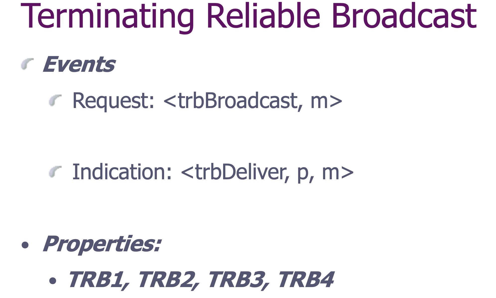
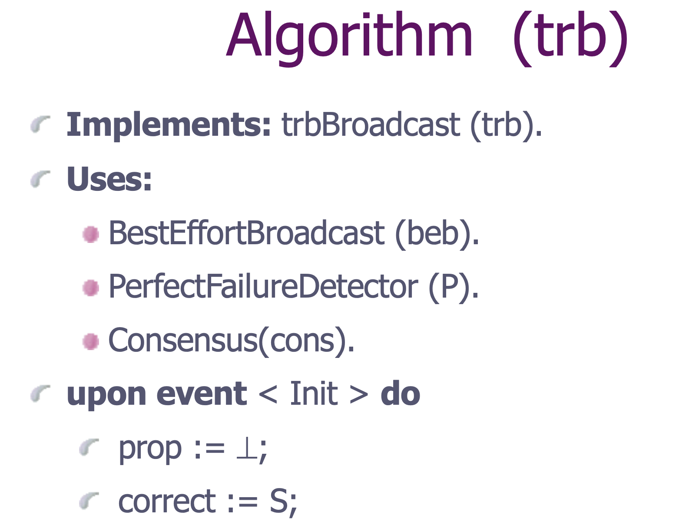
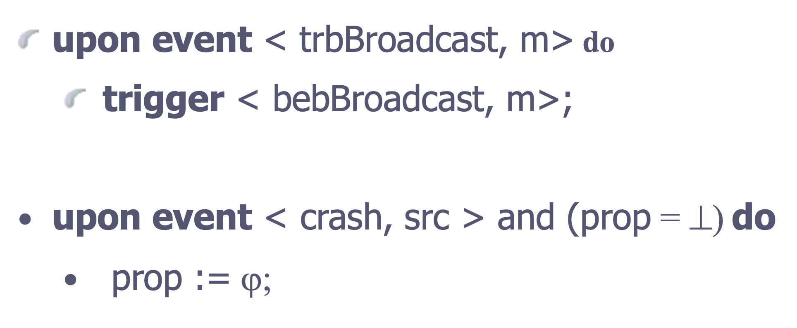
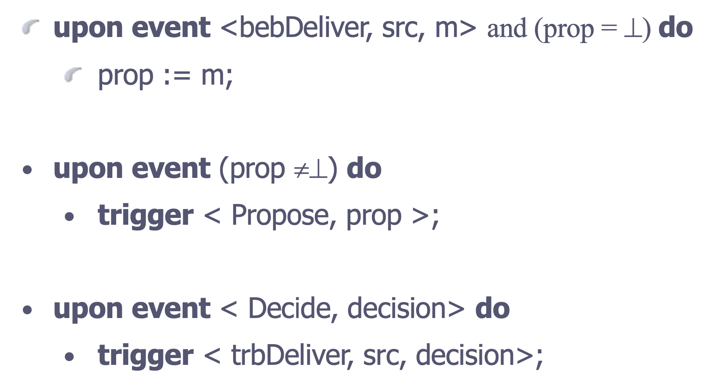
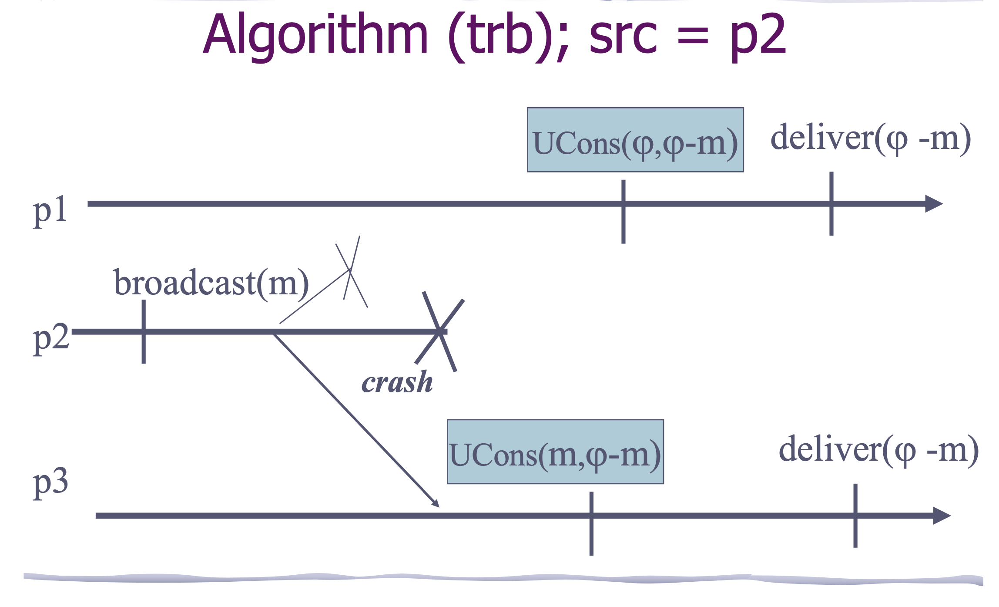
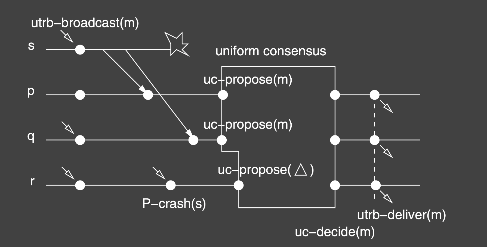

## Summary

总而言之, 我们可能会遇到一种情况, 在指定一个进程发送, 其他进程接收时, 发送进程发了消息但是crashes, 一部分接收进程能接收到(触发bebDeliver事件>, 但是一部分不能(该进程触发crash事件). 我们让前者接受到的就为m, 后者为一个特定值. 然后将这些进程通过(uniform) consensus, 决定我们最终要deliver的值.

## Overview

**Throwback**: Reliable broadcast: ensure that if a message is delivered to a process then it is delivered to all correct processes.

**terminating reliable broadcast** is a form of reliable broadcast with a specific **termination** property. 

**Use case**: a given process has the obligation of broadcasting some message to all processes in the system.

Like reliable broadcast, terminating reliable broadcast(TRB) is a communication primitive used to disseminate a message among a set of processes in a reliable way.

TRB is however strictly stronger than (uniform) reliable broadcast.

- Like with reliable broadcast, correct processes in TRB agree on the set of messages they deliver
- Like with (uniform) reliable broadcast, every correct process in TRB delivers every message delivered by any process.
- Unlike with reliable broadcast, every correct process delivers a message, even if the broadcaster crashes.

接收进程都在等待发送进程. 发送进程没有crash, 那接收进程就都deliver 发送进程发送的消息, 如果发送进程在接收进程接收到m前就crash了, 那就deliver 一个SF.

## Problem Description

A TRB protocol typically organizes the system into a sending process and a set of receiving processes, which may include the sender itself. 

A process is called "correct" if it does not fail at any point during its execution. 

The goal of the protocol is to transfer data(the "message") from the sender to the set of receiving processes.

A process may perform many I/O operations during protocol execution, but eventually "delivers" a message by passing it to the application on that process that invoked the TRB protocol.

The protocol must provide important guarantees to the receiving processes. All correct receiving processes, for example, must deliver the sender's message if the sender is also correct. A receiving process may deliver a special message,  ("sender faulty", also call $\varphi$), if the sender failed, but either *all* correct processes will deliver or *none* will.

A correct process is therefore guaranteed that data delivered to it was also delivered to all other correct processes.  

****

- The problem is defined for a specific broadcaster process pi = src(known by all processes)

- Process src is supposed to broadcast a message m(distinct from $\varphi$)

- The other processes need to deliver m if src is correct but may deliver $\varphi$ if src crashes.

  广播的是correct的就deliver它的消息, 否则就deliver别的

### Terminating Reliable Broadcast(pi)

**TRB1. Integrity**: If a process delivers a message m, then either m is $\varphi$ or m was broadcast by src.

**TRB2.Validity**:If the sender src is correct and broadcasts a message m, then src eventually delivers m

**TRB3. (Uniform) Agreement**: For any message m, if a correct(any) process delivers m, then every correct process delivers m.

**TRB4. Termination**: Every correct process eventually delivers exactly one message.

## Implementation 

### Consensus-Based Uniform Terminating Reliable Broadcast

One may think that the problem of the faulty sender could have been avoided if s had used a uniform reliable broadcast primitive to broadcast m. 

Unfortunately, this is not the case. Consider process p in the example. The use of a uniform reliable broadcast primitive would ensure that, if some other process q delivered m then p would eventually also deliver m. 

**However**, p cannot decide if it should wait for m or not. Process p has no means to distinguish the case where some process q has delivered m (and p can indeed wait for m), from the case where no process will ever deliver m(in this case p should definitely not keep waiting for m).

**The TRB abstraction adds precisely this missing piece of information to reliable broadcast. TRB ensures that every process p either delivers the message m from the sender or some failure indication, denoting that m will never be delivered by any process**

## TRB Algorithm ? Perfect Failure Detector P

- The TRB algorithm uses the perfect failure detector P 
- Is P also necessary?
  - Is there an algorithm that implements TRB with a failure detector that is strictky weaker than P? (this would mean that P is not necessary).
  - Is there an algorithm that uses TRB to implement P(this would mean that P is necessary)
- We give an algorithm that **implements P using TRB **; more precisely, we assume that every process pi can use an infinite number of instances of TRB where pi si the sender src
  - 1. Every process pi keeps on trbBroadcasting messages mi1, mi2, etc
    2. If a process pk delivers $\varphi$i, pk suspects pi.

